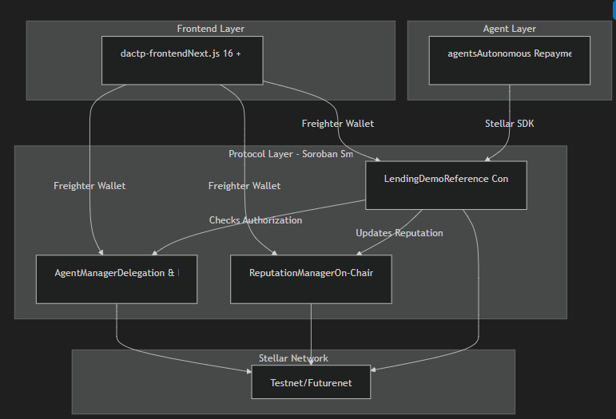
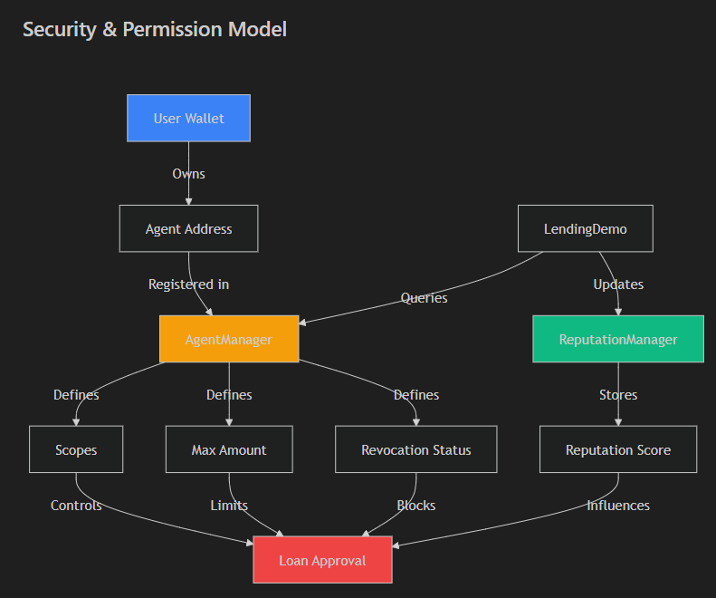
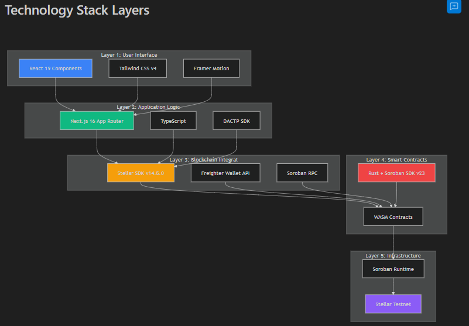
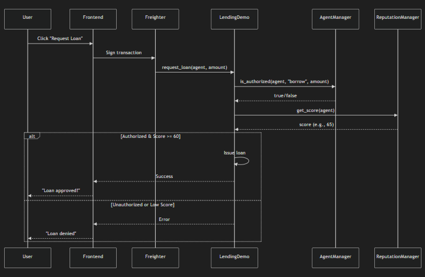
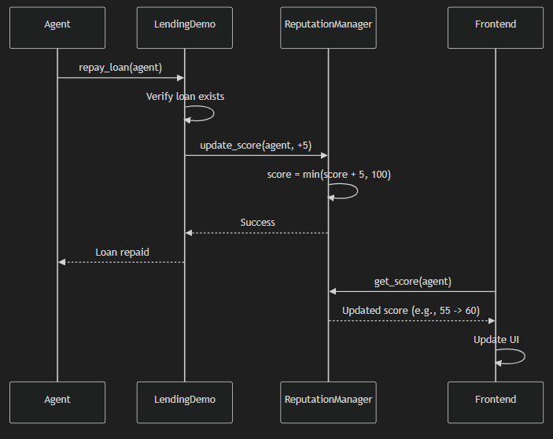

# 🛰️ DACTP
### Decentralized Agentic Compliance & Trust Protocol
> **"Trust is the New Collateral."**
> Making trust programmable, quantifying reputation, and enabling safe agentic finance on Stellar.



---

## 🌌 What Is DACTP?

**DACTP** (Decentralized Agentic Compliance & Trust Protocol) is a Soroban-native trust and delegation layer that brings **on-chain reputation**, **safe automation**, and **under-collateralized finance** to the Stellar ecosystem.

It operates as a **protocol, not just a product**. Any Stellar dApp, from lending pools to gig marketplaces, can plug into DACTP to inherit standardized reputation scoring and tightly scoped agent permissions.

### 🧠 Why DeFi Needs DACTP

Traditional finance runs on three pillars: **Trust**, **Delegation**, and **History**.
Web3, however, is often blind to user history, forcing:
*   **Over-collateralization**: Capital inefficiency (150%+ collateral) because "code doesn't trust you."
*   ** unsafe Automation**: Sharing private keys or granting unlimited allowances to bots.
*   **Fragmented Reputation**: Your good behavior on one dApp doesn't help you on another.

DACTP fixes this by answering one fundamental question for every interaction:
> **“Is this agent allowed to perform this action, and do they have the reputation to back it up?”**

---

## 💎 Core Primitives & Security Model

DACTP introduces a secure "Identity & Permission" layer that separates the **User (Principal)** from the **Agent (Actor)**.



### 1. Scoped, Revocable Agents
Users register agents (bots, scripts, or third-party services) bound to their identity. These agents are:
*   **Scoped**: Limited to specific actions (e.g., `["repay_loan", "borrow"]`).
*   **Capped**: Restricted by specific spending limits (e.g., `max_amount: 500 USDC`).
*   **Revocable**: Owners can instantly kill an agent's access on-chain if it misbehaves.

### 2. On-Chain Reputation (The "Credit Bureau")
*   **Score (0–100)**: A protocol-level reputation score (Default: 50).
*   **Dynamic Updates**: Scores move based on **real financial outcomes**.
    *   **Trust Building**: Slow (+5 on successful repayment).
    *   **Trust Loss**: Fast (-15 on default).
    *   **Fraud**: Instant freeze (0).
*   **No Central Oracle**: Only approved consumer contracts (like the LendingDemo) can write updates.

---

## 🏗 Technology Stack

DACTP is built as a full-stack protocol, integrating modern frontend UX with robust Soroban smart contracts.



| Layer | Technology | Role |
| :--- | :--- | :--- |
| **Frontend** | Next.js 16, Tailwind v4 | "Ethereal Indigo" UI, Dashboard, Visualizations. |
| **Logic** | DACTP SDK (TypeScript) | Connecting UI to contracts, managing agent auth. |
| **Protocol** | Rust / Soroban | Smart contracts (`AgentManager`, `ReputationManager`). |
| **Infrastructure** | Stellar Testnet | Final settlement and state consensus. |

---

## 🧪 End-to-End User Journey

The flow below demonstrates how a user delegates an agent to borrow funds, and how the protocol enforces reputation.

### 1. Requesting a Loan
When an agent requests a loan, the `LendingDemo` contract consults:
1.  `AgentManager`: "Is this agent authorized for 'borrow'?"
2.  `ReputationManager`: "Is the agent's score ≥ 60?"



### 2. Repaying & Building Trust
If the agent repays the loan successfully, the `LendingDemo` reports the success to the `ReputationManager`, which increments the agent's score. This unlocks better terms for future interactions.



---

## 🧱 Protocol Architecture (Smart Contracts)

| Contract | Role | Key Functions |
| :--- | :--- | :--- |
| **`AgentManager`** | **Identity** | `register_agent`, `revoke_agent`, `is_authorized` |
| **`ReputationManager`** | **Credit Bureau** | `get_score`, `update_score`, `freeze_reputation` |
| **`LendingDemo`** | **Consumer** | `request_loan`, `repay_loan`, `report_default` |

### Live Deployment (Testnet)

| Contract | Address |
| :--- | :--- |
| **Agent Manager** | `CD4L232BN5LS537F23LF4GAL53I6GV6JDKYQ73B6HE4YY6S6OZR3MS4R` |
| **Reputation Manager** | `CDWF4BNN2GTUHDKRBPSUA7K6NTIS75YYVHBSFFFDGWPWU635GZY6PHEN` |
| **Lending Demo** | `CD4ZOPXBNM7NV5FVY2L2ZW4TKLDC4B4CKHE3II5VCA743CPKFMH3N4WM` |
| **XLM Token** | `CB64D3G7SM2RTH6JSGG34DDTFTQ5CFDKVDZJZSODMCX4NJ2HV2KN7OHT` |

---

## 🖥️ User Interface Experience

The DACTP frontend is designed with a **"Modern-Classic Minimalist"** aesthetic to bridge institutional reliability with modern web3 capabilities.

*   **The Dashboard**: A command center showing your Reputation Score (0-100) and active delegations.
*   **Agent Marketplace**: A directory of pre-approved agents you can authorize with one click.
*   **Reputation Explorer**: Visualizes your trust history across the ecosystem.

---

## ⚙️ Getting Started

### Prerequisites
*   Node.js v18+
*   Rust & Cargo (wasm32 target)
*   Stellar CLI
*   Freighter Wallet

### 1. Build & Test
```bash
cd dactp-protocol
cargo build --target wasm32-unknown-unknown --release
cargo test
```

### 2. Run the Frontend
```bash
cd dactp-frontend
npm install
npm run dev
```
Open [http://localhost:5173](http://localhost:5173) to connect your wallet.

---

## 🔮 Roadmap

*   **Phase 1: Validation (Current)**
    *   Core Soroban contracts & Lending MVP.
    *   Basic reputation scoring logic.
*   **Phase 2: Productization**
    *   SDK v1.0 release.
    *   "Social Recovery" for agent control.
*   **Phase 3: Ecosystem**
    *   Integration with major Stellar DEXs.
    *   Cross-chain reputation bridges.

---

## � License
MIT © DACTP Protocol
